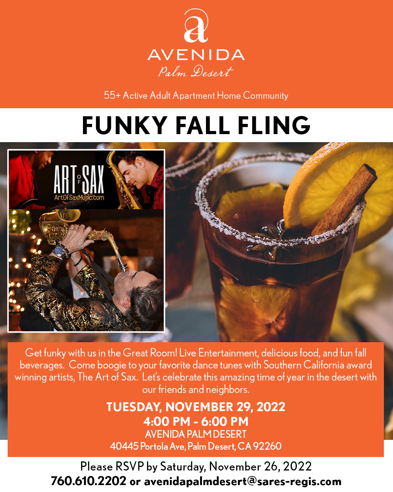

  
<h1><b> "Upcoming Event Information" </b></h1> <!-- Loads <model-viewer> for old browsers like IE11: -->

  

  
  

  <h2><b> "Exciting Event, Be Sure To RSVP" </b></h2>
   
  <!--

  
  

  <h2><b> "Important Event, Be Sure To RSVP" </b></h2>
    
  

  
  

  <h2><b> "Bringing Holiday Joy To Children" </b></h2> 
     -->
<h3 style="text-align: center;" markdown="1"><a href="https://avertek.net/xr-now" onclick="getOutboundLink('https://avertek.net/xr-now'); return false;">BOOSTED by AVERtek's XR-NOW</a></h3> 
    

