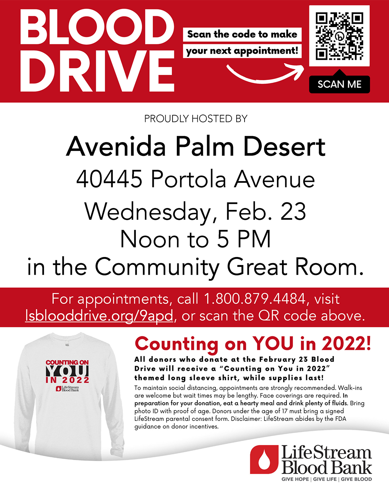
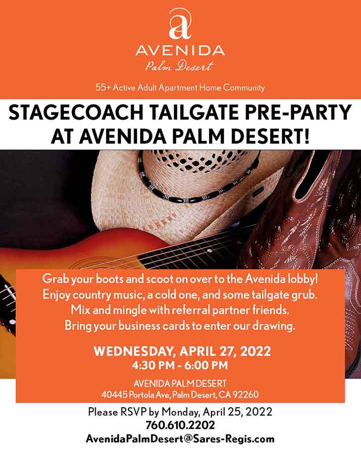

  
<h1><b> "Upcoming Event Information" </b></h1> <!-- Loads <model-viewer> for old browsers like IE11: -->

  <!-- 

  
  

   
  <h2><b> "Important Event, Be Sure To RSVP" </b></h2>
    -->
  

  
  

    
<h3 style="text-align: center;" markdown="1"><a href="https://avertek.net/" onclick="getOutboundLink('https://avertek.net/'); return false;">BOOSTED by AVERtek's XR-NOW</a></h3> 
    

